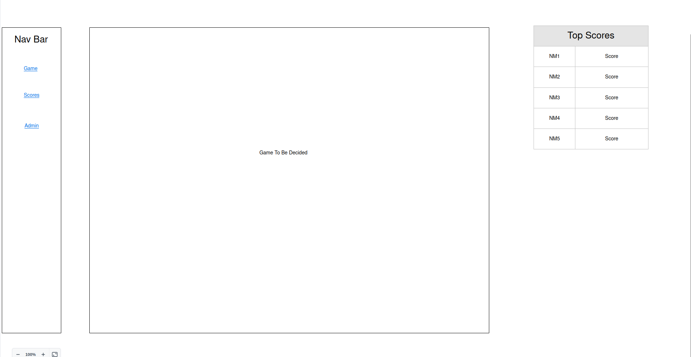
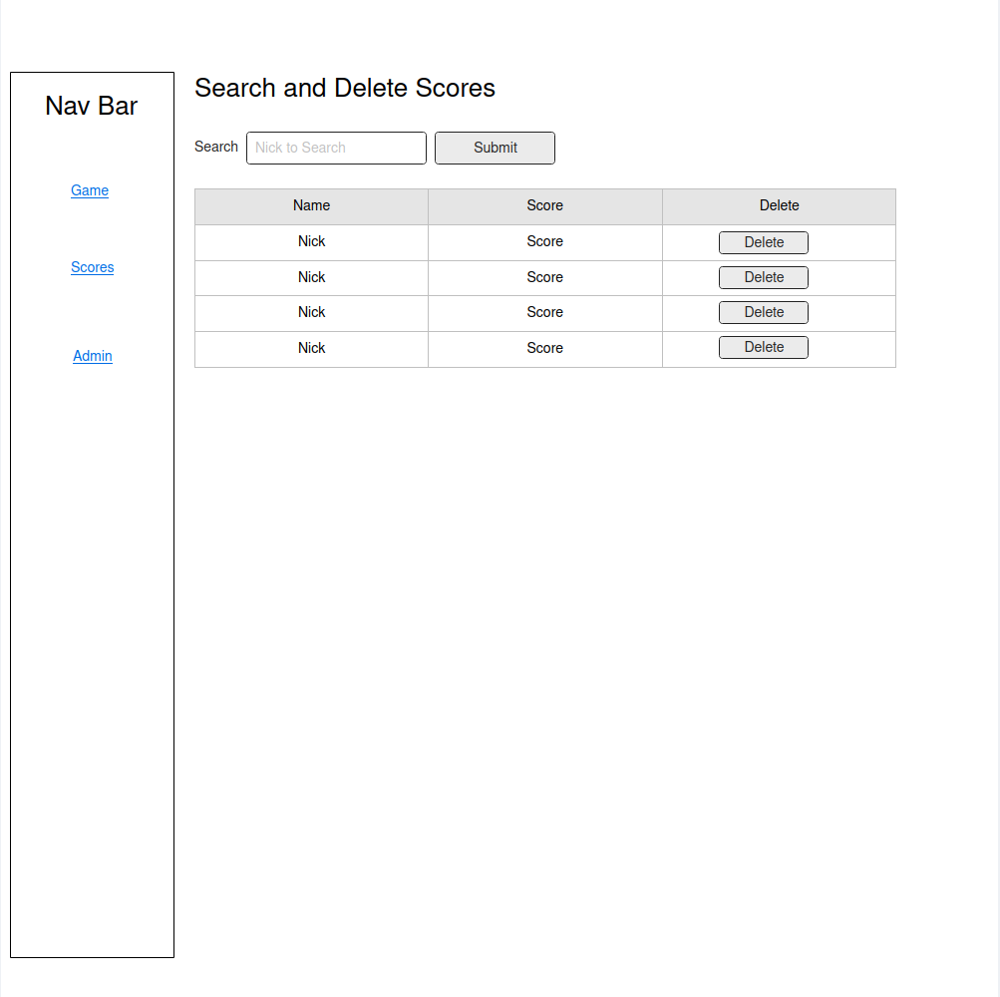
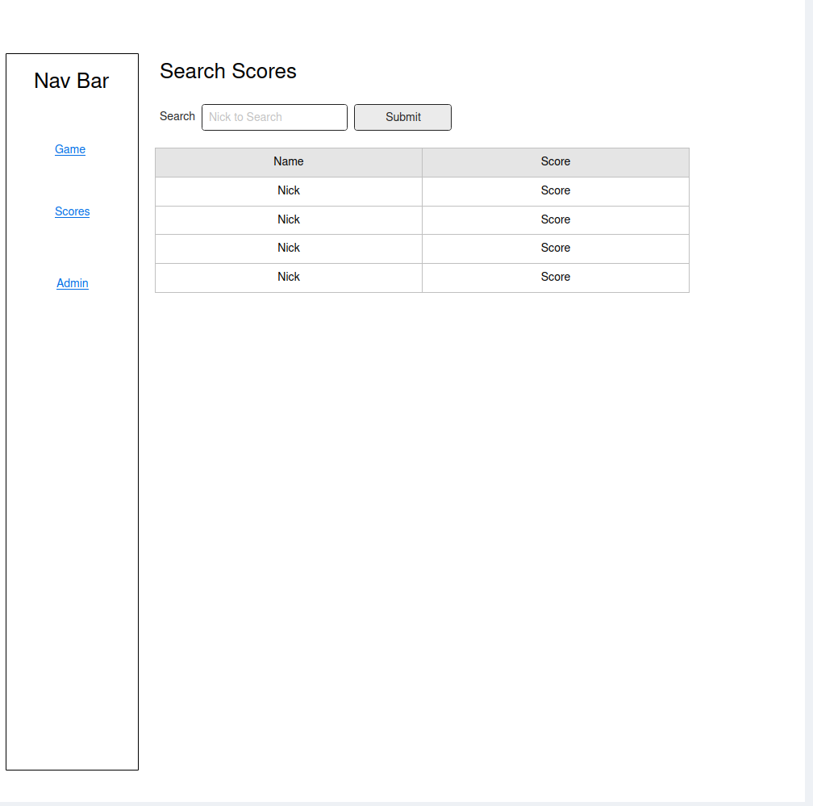

# CS408 Final Project

## Project Spec

For the project I plan on creating a game page that allows the user to play a game that has not been decided (though my thought is something akin to Solitaire). Once the game has been finished and a score finalized the user will be prompted to submit the score, this will ask the user to enter a nickname and then submit the score to the AWS server.

After a score has been submitted and been sent to the AWS database, if it is in the top 5 or so scores it will be displayed on the main page for anyone playing after to see, if not it will be able to seen on the scores page.

The scores page will allow any user to search through by a selected Nickname and see any scores submitted with that nickname. If no nickname is given then the user will be able to see all the scores and look through them by the highest score to the least.

There will also be an admin page that would allow an admin to delete any score that they felt was cheated and not got fairly, otherwise it would basically be the same as the Scores page. This page would require a correct username and password, the defaults will be given the readme once implemented for testing.

The target audience for the page will be gamers or those wanting to search out and claim a highscore, akin to an arcade machine. 

The data that will be collected will be the scores that a user would submit.

For the stretch goals of the project, I would want to extend the amount of games that would be offered and rather than have the index page be game, I would allow the user to select a given game from the catalogue. Each game would then have their own scores that with the top 5 being displayed on the page with the game, and the best score being displayed on the homepage. The score page would then be expanded so that the user would be able to sort the scores by game as well as by nickname.

## Project Wireframe

## Sources:

1. https://www.w3schools.com/css/css_dimension.asp 
2. https://www.w3schools.com/css/css_navbar.asp
3. 
